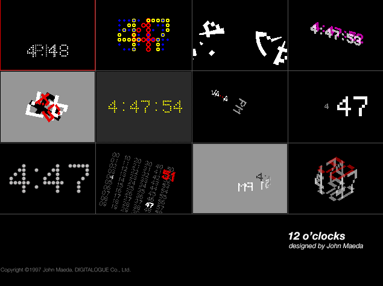
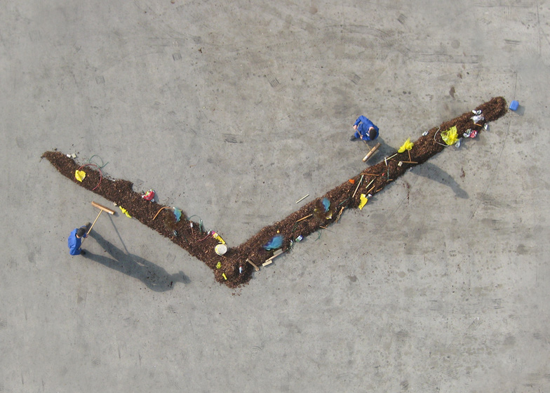
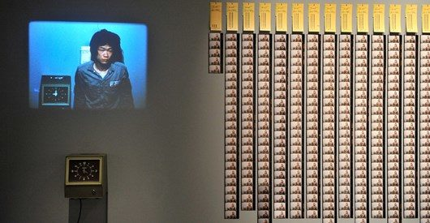

## History of Measuring Time

Measuring and visualizing time is a long-running human project that brings together histories of technological experimentation, politics, religion, and environmental measurement and observation. Early attempts to measure time were often based on environmental observations such as tracking the position of the sun, or measuring the movement of sand or water through a device or through observing other organisms.

The first timekeeper is likely the gnomon, a vertical rod that casts its shadow on the ground.

A similar strategy is used in sundials that have also been found to exist since BC 1500 in ancient Rome and Greece.

Hourglasses were used in churches to time the length of the sermon; long sermons were especially popular in the 17th century and could easily stretch to three hours or more.

In the 1800s, Carl Linnaeus, who invented our system of taxonomy, made flower clocks and calendars popular. He claimed that the time could accurately be told by observing several types of flowers and how they open, close, and track the sun. Gardeners would make elaborate plantings of these different types of flowers to show the passage of the year.

For a more contemporary attempt at telling the time by observing other organisms, [the Phenology Clock](http://tegabrain.com/The-Phenology-Clock) maps the timing of events in different species' lives across a year.

## Time and Technology

The introduction of railways across Europe and the USA in the 1800s created a need for time synchronicity across distances.

Today, computer networks continue to drive the development of technologies to synchronize time more precisely, for example Google's spanner is a technology to deal with time and synchronicity in large-scale, network-distributed databases. For more on this, see [this essay by media artist Brian House.](https://observatory.constantvzw.org/documents/brian_house_synchronizing_uncertainty.pdf).

## Different Design Approaches to Time

Time zones clock displays time across geography.

[Source](http://www.dezeen.com/2010/07/26/the-bent-hands-by-giha-woo-and-shingoeun/)

Knitting Clock displays time as a 3d tangible knitted form:

[Source](http://www.sirenelisewilhelmsen.com)

## Software Clocks

- **John Maeda 12 o’clocks**
John Maeda famously creates some early software clocks that have now ported to p5 js thanks to Shiffman and community. [See the code here.](https://codingtrain.github.io/12oclocks/)

[More info on this work](http://cmuems.com/2016/60212/lectures/lecture-09-09b-clocks/maedas-clocks/)  

- **Colour Clock** The [Colour Clock](http://www.thecolourclock.com/) displays the current time as a hexadecimal color. Hours = red, minutes = green, seconds = blue. 

- **Dot Clock by Vendian**
This example uses one dot to represent every second in the day:

- **Last Clock**  
<a href="https://player.vimeo.com/video/27975734" width="720" height="405" frameborder="0" allowfullscreen>The last clock</a> uses a technique called [slit scanning](https://www.youtube.com/watch?v=YqVbuMPIRwY) to make a clock out of camera pixels taken at a frequency of seconds, minutes and hours.
- This twitter clock, **[All the Minutes](http://alltheminutes.com/)**, that is now retired of course, was comprised of tweets about the current time.
- Sam Lavigne is an artist known for his political art, makes a clock that counts the time served by the prison population in the USA.  
[21092 Millennia, 8 Centuries, 49 Years](https://lav.io/projects/21092-millennia-8-centuries-49-years)

## Time and Labor in Art

- Here’s **[Sweeper Clock](http://dezeen.com/2009/06/07/sweeper-clock-by-maarten-baas/)** by Maarten Bas, a movie featuring two men with brooms pushing lines of debris to form moving clock hands.  [Video documentation is here.](https://player.vimeo.com/video/11164881) 

- **TEHCHING HSIEH** is a pioneer performance artist who has long explored time. [See his official Website](https://www.tehchinghsieh.com/) or [video on his work.](https://www.youtube.com/embed/FsF-4UJjTaQ).
His Time Clock Piece (One Year Performance 1980-1981) is a durational performance of Hsieh punching time cards into an industrial time-clock everyday on the hour for one year. Hsieh’s performance took place privately in his small New York studio, and was documented with a 16mm film camera, positioned ahead of Hsieh and the industrial time-clock. On every hour when Hsieh punches the time-clock, a single frame is taken on the film, amounting to 24 stills a day and 8760 in a year. The stills were compressed into a 6 minute silent time-lapse film, flashing 24 frames per second, a direct correspondence to the cultural measure of time. 

**Felix Gonzalez-Torres: ["Untitled" (Perfect Lovers) 1991](https://www.moma.org/collection/works/81074)**

Initially set to the same time, these identical battery-powered clocks will eventually fall out of sync, or may stop entirely. Conceived shortly after Gonzalez-Torres’s partner was diagnosed with AIDS, this work uses everyday objects to track and measure the inevitable flow of time. When one of the clocks stops or breaks, they can both be reset, thereby resuming perfect synchrony.

A well-known ‘crowdsourced’ clock is Christian Marclay’s **[The Clock](http://en.wikipedia.org/wiki/The_Clock_%282010_film%29)**, a 24-hour film made up of six or seven thousand clips, each of which either says or displays the (actual) time of day or makes a cogent reference to time.

[Watch on YouTube](https://www.youtube.com/watch?v=0gSwtr3E4Fo)

See many more examples here:
- Golan Levin, [Visualizing Time](http://golancourses.net/2015/lectures/visualizing-time/)
- Paolo Perdicini, [Visualizing Time](http://cmuems.com/2013/b/visualizing-time/)

